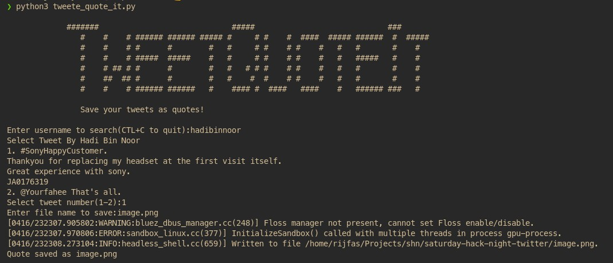

## Team : NullPointerExceptionHandlers

### Project Name : TweeteQuoteIt!

---

## TweeteQuoteIt!

TweeteQuoteIt! is a simple cli tool that can be used to generate quotes from tweets and convert them into beatiful images

## How to use

- Search a user by name
- Select the tweets of the user
- Save the image file!

## Usage Example

### Output

## Techs/Libraries Used

- [Python](https://www.python.org/)
- [Twitter API](https://developer.twitter.com/en/docs/twitter-api)
- [Html2Image](https://pypi.org/project/html2image/)

## Contributors

- [Rijfas](https://github.com/rijfas)
- [Umayya Nahan](https://github.com/FaizArifUP)
- [Thamjid](https://github.com/Thamjid)
